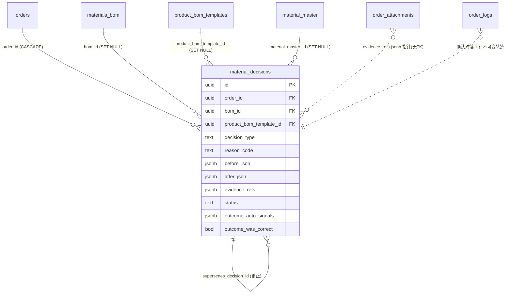

# 绮陌 OS — Knowledge Layer K0/K1 设计（V0.1 草案 · 待审批）

> 层级：`docs/Designs/`（阶段实施方案）。**本文件只做审计 + 四问 + 九章设计 + migration 草案。**
> 治理红线（本阶段严格遵守）：**不编码 / 不执行 migration / 不 commit / 不 push / 不引入图数据库 / 不引入向量库 / 不做 RAG / 不做 AI 自动改业务规则 / Knowledge Layer 不成为第二套业务真相。**
> 一句话定位：**Knowledge Layer 第一阶段不是让 AI 学习，而是确保每一个重要决策都留下可追溯的「原因、证据、结果」。**

---

## 0. 现状审计（先审计，不假设字段存在）

审计基于真实 DDL（`supabase/migration.sql` + `supabase/migrations/*.sql` 共 224 个迁移）与代码路径。结论如下。

### 0.1 材料决策的锚点对象链（已用 FK 验证）

```
product_bom_templates            产品级 BOM 模板（development_consumption / production_consumption）
  └─ materials_bom               ★ per-order 可编辑 BOM = "Order Material Package"（Override 发生在这里）
       └─ material_package_snapshot_lines   提交采购时冻结的不可变快照（ECM）
            └─ material_requirements        Explainable MRP 投影（gross→net→confirmed）
                 └─ procurement_items       核料确认（final_purchase_qty，权威）；补料标记在此
                      └─ procurement_line_items  执行行（ordered_qty / received_qty，1:N 拆分）
                           ├─ purchase_orders     PO 头
                           └─ goods_receipts       逐批到货（received_qty）
```

**关键澄清**：任务书里反复出现的 `materials_bom` **确实存在**，但它不在常规 `CREATE TABLE` 扫描结果里——它建于早期单体 `supabase/migration.sql:538`，之后被约 15 个 ALTER 迁移扩展。它就是「Order Material Package」。`material_package_snapshots` 是它的**冻结快照**，不是 Override 本身。

### 0.2 `materials_bom` 已有的「薄 Override 审计」（这是 K1 的直接前身）

`20260629_materials_bom_product_link_2a.sql` 已加 5 列：

| 列 | 含义 | 局限 |
|---|---|---|
| `product_bom_template_id` | 实例化自哪条模板（跨域 FK, SET NULL） | ✅ 完好 |
| `source` | `'template'` / `'manual'`（运行时还有 `line_items_sync`/`file_parse`） | ✅ 完好 |
| `override_reason` | Override 原因 | ⚠️ 可选、无校验、**仅模板行**、**被下次编辑覆盖** |
| `overridden_at` / `overridden_by` | 谁/何时 | ⚠️ 仅模板行；行内标量，**无历史** |

该迁移头注明确写着：**「最低限度追踪 Override，不建 override 明细表」**。**那张被主动推迟的「override 明细表」，就是 K1 要补的空白。** 现状：`updateBomItem`（`app/actions/bom.ts:476`）就地覆盖、不存改前值、不分类型；`deleteBomItem`（`bom.ts:498`）是硬删除、无墓碑；UI 在 `components/tabs/BomTab.tsx`，Override 原因框（:687）可选自由文本。

### 0.3 复用清单（避免建第二套真相）

| 需要的能力 | 现有可复用 | 结论 |
|---|---|---|
| 证据文件存储 | `order_attachments`（bucket `order-docs`，含 `file_url/storage_path/mime_type/file_type/uploaded_by`） | ✅ 复用；用 `file_type` 值扩展（现有值如 `'customer_po'`）。**别用**已废弃的 `attachments`（绑死 milestone） |
| append-only 事件轨迹 | `order_logs`（`action/from_status/to_status/note/payload jsonb`，append-only，订单级） | ✅ 复用一行做不可变轨迹；**K1 不建 `business_events` 表** |
| 更正（不可变前提下改） | `material_package_snapshots.supersedes_snapshot_id` 的 supersede 模式 | ✅ 照搬：更正=新行盖旧行，旧行 `status='superseded'` |
| 原因码分类范式 | `order_root_causes`（`cause_domain/cause_type/cause_code/severity/source/evidence_json`）、`decision_feedback` 的「override_reason ≥5 字符」强 CHECK | ✅ 学范式，另立**材料决策专属**原因码 |
| 「决策是否正确」outcome | `order_outcome_reviews`（`final_result/decision_was_correct/initial_decision_id`）**但零写入、休眠**，且是 **1:1/订单**粒度 | ⚠️ **不要**新建 per-order outcome 表（会重复它）；材料决策 outcome 是 **per-decision** 粒度、当前空白 → **内嵌在决策行**，K2 再与它对账 |
| 字段级 before/after + 原因 + 审批 范式 | `order_amendments`（`fields_to_change jsonb {from,to}` + `reason` NOT NULL + 审批），字段门在 `lib/domain/amendment-policy.ts` | ✅ 学范式，材料版做 `material-decision-policy.ts` |
| RLS 可见性 | `user_can_access_order(uid,oid)` / `user_can_see_all_orders(uid)`（admin/finance/admin_assistant/production_manager 看全部） | ✅ 直接复用 |
| 只读投影器范式 | Runtime Confidence（`runtime_events` append-only + fire-and-forget 钩子 + service-role 写/user 读） | ✅ Outcome 投影器照此建 |

### 0.4 Outcome 链现状（决定 K1 能自动算多少）

7 环里 **5 环已录、2 环缺**：

| 环 | 状态 | 真实字段 |
|---|---|---|
| 1 模板单耗 | ✅ | `product_bom_templates.development/production_consumption` |
| 2 订单 Override | ✅ | `materials_bom.qty_per_piece` / `production_consumption` + 审计列 |
| 3 采购数量 | ✅ | `procurement_items.final_purchase_qty`（权威）/ `procurement_line_items.ordered_qty` |
| 4 补料 | ✅ | `procurement_items.is_supplement / supplement_base_item_id / finance_approval_status` |
| 5 剩余库存 | ⚠️ **仅全局** | `inventory_transactions`（全局台账）；**per-order 余料无专列** |
| 6 实际单耗 | ❌ **缺** | 仅 `order_cost_baseline.actual_consumption_kg`（=到货÷件数的代理值，非实测）+ 面料专属 JSON marker |
| 7 成本/交付 | ✅ | `order_financials.cost_material` vs `cost_material_actual`(+coverage)；`procurement_reconciliations.net_payable`；`order_outcome_reviews`；`profit_snapshots` |

**战略含义**：**「单耗改太低 → 跑短 → 被迫补料」这条最强因果信号，今天就能自动算**（`is_supplement`）。加上超买/欠买（`procurement_line_items.difference_pct`）、材料成本差（`cost_material` vs `cost_material_actual`），K1 的 Outcome **绝大部分可自动投影**，**无需**依赖缺失的第 5、6 环。第 5、6 环（真实单耗准确度、每单余料）留 K2 在开裁/领料处新捕获。

---

## 一、四问回答

### Q1：Knowledge 的最小单元是什么？

**六个概念，严格分层，禁止把普通操作日志直接叫 Knowledge。**

| # | 概念 | 定义 | 本项目载体（K1） | 可变性 |
|---|---|---|---|---|
| 1 | **Business Event** | 已发生的客观事实（名词+过去式），不含 UI、不含判断 | K1 **复用 `order_logs`** 落一行 `material_decision_captured`；**不建新表**（spec 见 K0，表留 K2） | append-only 不可变 |
| 2 | **Decision Record** | 人在某业务点做的**一次带原因的选择**：改了什么、从什么到什么、为什么、预估影响 | **新表 `material_decisions`**（K1 唯一新增表） | facts write-once；状态机推进 |
| 3 | **Evidence** | 支撑该决策的**文件/附件/外部引用**（客户邮件、产前样照片、报价单…） | **复用 `order_attachments`**，`material_decisions.evidence_refs jsonb` 指针 | 引用不可变 |
| 4 | **Outcome** | 该决策**事后被现实检验的结果**：补料了吗、超买了吗、成本差多少、回头看对不对 | **内嵌 `material_decisions` 的 outcome_* 列**（自动信号 + 人工因果判定） | 后填一次 |
| 5 | **Knowledge Candidate** | 从**多条**「决策+结果」里被归纳出的**疑似规律**，尚未审批 | **K2** 才建 `knowledge_candidates`（K1 不建） | under_review |
| 6 | **Approved Knowledge** | 经人类审批、**有适用范围、有版本、可撤销**的正式企业知识 | **K2** 才建 `knowledge_items`（K1 不建） | versioned/reversible |

**关系链**：
```
Business Event（事实） ──触发──▶ Decision Record（选择+原因+证据）
                                      │
                            现实检验（补料/成本/交付）
                                      ▼
                                 Outcome（结果+因果判定）
                                      │
                        多条(决策+结果)统计归纳（K2）
                                      ▼
              Knowledge Candidate ──人类审批──▶ Approved Knowledge（有范围/版本/可撤销）
```

**为什么普通日志 ≠ Knowledge**：`order_logs` 记「状态从 A 到 B」是**事实**（Event），不含「为什么、依据、后果」。Knowledge 必须携带**原因 + 证据 + 结果 + 被审批的范围**。K1 只做到 Decision + Evidence + Outcome（前四层）；后两层（归纳、审批成知识）**明确留给 K2**——这正是任务书「第一阶段不是让 AI 学习」的落地。

### Q2：Knowledge Layer 如何关联现有业务对象？

**结论：K1 用「显式 FK」，不用 `entity_type + entity_id`。** 理由与设计：

1. **代码库主流是显式 FK**（审计实证）：`order_attachments.order_id`、`milestone_logs.(milestone_id,order_id)`、`procurement_logs.line_item_id`、`runtime_events.order_id` 全是显式 FK + `ON DELETE` 规则。多态（`entity_type+entity_id`）只在边缘表出现（`system_alerts`、`contract_access_log`），且是弱引用、无 FK 保护。
2. **K1 只碰材料决策，关联对象是**确定的**四个**：`orders` / `materials_bom` / `product_bom_templates` / `material_master`——用四个显式 FK 表达最清晰、有删除规则保护、PostgREST 可直接 join。**没有「弱引用失控」风险**，因为 K1 不做跨域泛化。
3. **删除规则护线上**：`order_id` = `ON DELETE CASCADE`（订单没了决策也没意义）；`bom_id / product_bom_template_id / material_master_id / actor_id` = `ON DELETE SET NULL`（live 行/模板/用户可能被改删，**但决策历史必须留**）。因此额外**反范式冗余** `material_name / material_code`（物料身份快照），保证行被删后仍可读。
4. **需要哪些索引**：`order_id`（跟随订单查/RLS）、`bom_id`（按 BOM 行追历史）、`product_bom_template_id`（按模板反查所有实例的 Override，做 K2 归纳）、`status`（投影器扫 outcome_pending）、`reason_code`（统计重复原因）。
5. **跨域扩展能力怎么留而不失控**：**不在 K1 建多态大表**；改为在 **K0 定义 Decision Record「契约」（列形状）**，K2 若要覆盖 QC/物流决策，就**按域各建一张**同形状表（`quality_decisions`…），而非一张 god-table。这符合宪法「Build once generate everywhere」= 契约定义一次、按域实例化，而非「一张表装所有域」造第二真相源。
6. **范围绑定**：加一列 `scope_json jsonb`（决策时打戳 `{customer, product_category, material_category, factory}`），K2 归纳知识时有边界上下文，不必回溯 join。对齐核心原则 3「Scope-bound」。

### Q3：什么情况下必须记录决策原因？（Trigger Policy —— 不得每次编辑弹框）

**分三档**，规则集中在新建 `lib/domain/material-decision-policy.ts`（照 `amendment-policy.ts` 范式）。

| 编辑动作 | 档位 | 原因 | 证据 | 审批 |
|---|---|---|---|---|
| 改单耗，`\|Δqty_per_piece\|/old ≥ 阈值`（默认 5%），且行=**模板来源** 或 `submit_status='submitted'` | **关键决策** | ✅ 必填 reason_code | 条件必填* | K1 不新增 |
| 换料（`material_master_id`/`material_name` 变）在模板来源/已提交行 | **关键决策** | ✅ 必填 | 条件必填* | K1 不新增 |
| 删除**模板来源**行（删掉工程物料） | **关键决策** | ✅ 必填 | 可选 | K1 不新增 |
| 已提交采购后（`submit_status='submitted'` 或快照已 approved）**任何**改动/新增 | **关键决策** | ✅ 必填 | 可选 | K1 不新增 |
| 数量/`over_purchase_pct` 覆盖偏离建议 ≥ 阈值 | **关键决策** | ✅ 必填 | 可选 | K1 不新增 |
| draft 阶段、阈值内、manual 行的编辑（还在搭包） | 普通编辑 | ❌ 不记 | ❌ | ❌ |
| 备注/位置文字/图片附件等外观字段 | 普通编辑 | ❌ 不记 | ❌ | ❌ |

\* **证据条件必填**（K1 用 policy 表达，先软约束在 app 层）：`reason_code='customer_request'` → 建议附客户确认；`'quality_issue'` → 建议附缺陷证据；`'price_optimization'` 且金额 > 阈值 → 建议附报价。K1 **不做强制审批**（最小实现）；高影响决策路由审批留 K2。**强约束**只保留一条对齐现有风格的 DB CHECK：`reason_code='other'` 时 `reason_note` 必填 ≥5 字符（仿 `decision_feedback` 的 override_reason CHECK）。

**关键点**：阈值 + 「是否已提交采购」是触发闸门——**只有真正有下游成本/采购后果的改动才捕获**，draft 阶段自由编辑零打扰。

### Q4：如何判断一次决策最终是否正确？

**Outcome 分两半：可自动算的「信号」 + 必须人工下的「因果结论」。绝不把相关性当因果。**

```
Template Consumption → Order Override → Procurement Qty → Replenishment(补料)
                                                              → Remaining Stock → Actual Consumption → Cost/Delivery Outcome
```

**（A）自动计算（Outcome 投影器，只读现有表，fire-and-forget，仿 Runtime Confidence）** → 写入 `outcome_auto_signals jsonb`：
- **补料信号（最强）**：该决策相关物料是否出现 `procurement_items.is_supplement=true`（尤其 `supplement_base_item_id` 指回原项 = 数量补 = 很可能单耗定低了）。
- **超买/欠买**：`procurement_items.suggested_purchase_qty` vs `final_purchase_qty`；`procurement_line_items.difference_pct`。
- **材料成本差**：`order_financials.cost_material` vs `cost_material_actual`（+ `cost_actual_coverage`）；`procurement_reconciliations.net_payable`。
- **交付/毛利**：`order_outcome_reviews` / `profit_snapshots` / `order_finance_events`（订单级，作背景）。

**（B）人工判定（不可自动，防相关性≠因果）** → `outcome_was_correct` + `outcome_attributed_cause`：
- 补料**不必然**是单耗错——也可能是裁剪损耗、质量返工、客户加单。**因果归属必须人来判**。自动信号只是**候选提示**，人类确认才算数（对齐 DP-5「AI 永不拥有真相」、核心原则 2「Human-approved」）。

**回填时机 / 谁确认 / 订单未结束怎么办**：
- 决策 `confirmed` 后进入 `outcome_pending`；投影器在**采购确认 / 到货 / 补料发生**时增量更新 `outcome_auto_signals`（订单没结束就先攒信号）。
- 到**订单接近收口**（对账完成 `procurement_reconciliations` / 全部到货 / 进入复盘）时，采购/管理员在 Learning Center 做一次人工 `evaluated`：填 `outcome_result` + `was_correct` + 归因 → `closed`。
- 订单未结束：状态停在 `outcome_pending`，只显示自动信号，不逼人下结论。
- **哪些指标自动 / 哪些人工**：自动 = 补料(Y/N+量+原因)、超欠买%、成本差%、交付结果；人工 = 因果是否成立、真实单耗准确度（后者还依赖 K2 新捕获，K1 诚实标注「不可评」）。

---

## 二、Problem & Objective（第 1 章）

- **问题**：一次 Material Override（把单耗 1.20 改 1.28、把料 A 换 B、删/加物料）今天只在 `materials_bom` 行上留一个**会被覆盖的、可选的**原因，**没有** before 值、类型、证据、历史、结果。事后无法回答「当初为什么改、依据什么、最后对不对」，经验无法沉淀。
- **目标（K1）**：让系统**第一次能完整记录一次 Material Override 的原因、证据、以及最终是否正确**——建立 Decision → Evidence → Outcome 的可审计闭环。
- **非目标**：不做 AI 学习、不做自动推荐/执行、不做知识审批工作流、不建向量/图/RAG、不改 B1/P1′ 读取、不改产品 BOM 模板、不建第二套物料或订单真相。

## 三、Scope / Non-scope（第 2 章）

**In（K1）**：Product BOM Template / Order Material Package(`materials_bom`) / Material Override / 后续采购数量与补料结果的**决策捕获与结果评估**。1 张新表 `material_decisions` + 复用 `order_attachments`/`order_logs` + 1 个只读 Outcome 投影器 + 嵌入 BomTab 的轻量 Decision Capture + 只读 Learning Center。

**Out（K1）**：财务/QC/物流/客服决策；全供应商评分；全公司知识；自动推荐/执行；`business_events`/`knowledge_candidates`/`knowledge_items` 表；真实单耗与每单余料的新捕获（依赖开裁/领料改造，留 K2）；审批工作流。

## 四、Domain Model（第 3 章）

**归属域**：Material / 供应链域（`docs/Domains/Procurement.md` 邻接，ADR-002 材料需求脊柱、ADR-004 采购分层的延伸）。**双门禁**见第 9 章。

**唯一新对象**：`material_decisions`（Decision Record 契约在 Material 域的实例）。它**不拥有**任何物料/订单/采购主数据——只记录「一次对 `materials_bom` 的带原因选择」及其结果。物料真值仍在 `materials_bom`（行内 `override_reason` 保留为**当前态**denormalized 指针），采购真值仍在 `procurement_items`。**无第二真相源。**

### ER 草图（K1）



## 五、Data Flow（第 4 章）

### 捕获时序（改单耗 / 换料 / 删加）

```mermaid
sequenceDiagram
    participant U as 用户(跟单/采购)
    participant BT as BomTab.tsx
    participant P as material-decision-policy
    participant A as bom.ts / material-decisions.ts
    participant DB as Supabase

    U->>BT: 编辑 BOM 行(单耗 1.20→1.28)
    BT->>P: 判定档位(阈值/是否已提交)
    alt 关键决策
        P-->>BT: 需捕获 → 弹轻量 Decision Capture
        U->>BT: 选 reason_code + 说明 + (可选)证据; 见预估影响
        BT->>A: updateBomItem(patch) + captureMaterialDecision(...)
        A->>DB: UPDATE materials_bom(当前态,含 override_reason)
        A->>DB: INSERT material_decisions(status=confirmed, before/after)
        A->>DB: INSERT order_logs(action=material_decision_captured)  %% 不可变轨迹
    else 普通编辑
        P-->>BT: 直接保存,不打扰
        BT->>A: updateBomItem(patch)
        A->>DB: UPDATE materials_bom
    end
```

### 结果投影（订单推进中，只读、永不阻塞）

```mermaid
sequenceDiagram
    participant H as 采购/补料动作(现有链路)
    participant PR as outcome-projector(fire-and-forget)
    participant DB as Supabase
    H-->>PR: 采购确认/到货/补料 后触发(仿 runtime hooks)
    PR->>DB: 只读 procurement_items.is_supplement / difference_pct / cost_material_actual
    PR->>DB: UPDATE material_decisions.outcome_auto_signals, status=outcome_pending
    Note over PR,DB: 只读业务表,不改任何业务真相;失败静默,不阻塞主链
```

## 六、Lifecycle & State Machine（第 5 章）

**K1 只实现 Decision 状态机；Knowledge Candidate/Item 状态机留 K2。**（明确建议：任务书 §8 允许 K1 只做 Decision。）

```
draft ──(捕获确认)──▶ confirmed ──(投影器攒到信号)──▶ outcome_pending ──(人工评估)──▶ evaluated ──(收口)──▶ closed
   │                       │
   └────更正:新行 supersedes 旧行,旧行─────────────────────────────────────────▶ superseded
```

- **facts write-once**：`decision_type/reason_code/before_json/after_json/actor_id/decided_at` 一旦 `confirmed` 不改。要改 = **建新行** `supersedes_decision_id` 指旧行、旧行 `status='superseded'`（照搬 `material_package_snapshots.supersedes_snapshot_id`）。→ 满足核心原则 1「Append-only，只追加更正」。
- **outcome_* 列**：`outcome_pending → evaluated` 期间后填一次。
- **append-only 不可变底座**：由 `order_logs` 那一行提供（它本身 append-only）。`material_decisions` 是「可推进状态的工作记录」，其**事实核**write-once、更正走 supersede——两者组合 = 既可用又不可篡改。

## 七、API / Service Design（第 6 章）

新增 `app/actions/material-decisions.ts`（Server Actions，全部 `auth + 角色 + user_can_access_order` 校验）：

| 函数 | 作用 | 权限 |
|---|---|---|
| `captureMaterialDecision(input)` | 由 BomTab 在关键编辑时调；写 `material_decisions(confirmed)` + `order_logs` 轨迹。**与 `updateBomItem` 同事务边界**（先写 BOM 当前态，再写决策；决策写失败**不回滚 BOM**、只告警——决策捕获永不阻塞业务，仿 runtime 钩子） | 跟单/采购/admin |
| `listMaterialDecisions(orderId)` | 订单维度决策历史（BomTab 侧栏 + Learning Center） | 跟随订单可见性；价格列按角色屏蔽 |
| `evaluateMaterialDecision(id, verdict)` | 人工回填 `outcome_result/was_correct/attributed_cause` → `evaluated` | 采购/production_manager/admin |
| `supersedeMaterialDecision(id, newInput)` | 更正：新行盖旧行 | 原 actor/admin |
| `projectMaterialDecisionOutcome(orderId)` | 只读投影器（内部/cron/钩子调），算 `outcome_auto_signals` | service-role |

**不新增** AI 接口、不新增审批接口（K1）。价格字段（`estimated_impact_amount`、成本类 auto_signals）在 service 层按角色**列级屏蔽**（对 `production/merchandiser/admin_assistant` 隐藏——对齐 CLAUDE.md 价格红线）。

## 八、UI / UX（第 7 章）

**不建复杂「知识平台」。两处：**

1. **嵌入式轻量 Decision Capture**（改造 `components/tabs/BomTab.tsx` 现有 Override 原因框）：
   - 命中关键决策时，把现在的自由文本框升级为：**结构化 `reason_code` 下拉 + 说明（条件必填）+ 可选证据上传（走 `order_attachments`）+ 预估影响只读展示（数量/金额，金额按角色显隐）**。
   - 普通编辑：**保持现状零打扰**。
   - 复用现有 provenance 徽章（🧬模板/✏️已改/📄识别/手动），已改行点开可看**该行决策历史**（新增只读 popover）。

2. **只读 Learning Center**（新页 `app/learning/` 或挂 admin，K1 只读、无 AI 结论）：
   - 最近关键 Override / 待结果评估(outcome_pending) / 重复原因(按 `reason_code` 聚合) / 未附证据的决策 / 单耗偏差趋势。
   - 「待评估」列表 = 采购做人工 `evaluate` 的入口。

## 九、Migration / Rollback（第 8 章）

**纯加法、幂等、可回滚；1 张新表 + 索引 + RLS，不动任何现有列/表/RLS。** 详见文末**附录 A（migration 草案，DO NOT APPLY）**，含 8 项数据库门禁验证 SQL 与 rollback SQL。回滚 = `DROP TABLE material_decisions`（新表空、无业务代码强依赖、`order_attachments`/`order_logs`/`materials_bom` 均未改结构）。Feature Flag：`KNOWLEDGE_LAYER_CAPTURE`（默认 `off`），off 时 BomTab 不弹捕获、投影器 5ms 内跳过——对齐 Runtime Confidence 的灰度/回滚范式。

## 十、Risk / Governance / DoD（第 9 章）

### 对象准入双门禁（`material_decisions`）
- **🏛 Architecture Gate**：属 Material/供应链域；数据所有权=**它只拥有「决策事实」**，不拥有物料/采购/订单真值（那些留原表）；**无重复真相**（`materials_bom.override_reason` 是当前态指针，`material_decisions` 是历史+结果，粒度/职责不同）。
- **🔮 Future Gate**：3 年后/10 工厂/多域仍成立——因为 K1 只实例化 Material 域一张表，K0 契约保证 K2 按域扩展不需重设计；`scope_json` 预留知识边界。

### 主要风险与缓解
| 风险 | 缓解 |
|---|---|
| 变成第二套物料真相 | `material_decisions` 无物料主数据，只引用；BOM 值只在 `materials_bom` |
| 与休眠 `order_outcome_reviews` 重复 | 粒度不同（per-decision vs per-order）；K1 不建 per-order outcome 表；K2 明确对账，不双跑 |
| 弹框骚扰 | 阈值 + 已提交闸门；draft 零打扰 |
| 相关性当因果 | 自动信号仅候选，因果必须人工 `was_correct` |
| 价格泄露 | service 层列级屏蔽 production/merchandiser/admin_assistant |
| 阻塞主链路 | 捕获/投影 fire-and-forget，失败静默告警 |

### K1 DoD（对齐 `docs/00-Constitution/Definition-of-Done.md`）
- [ ] migration 草案齐全：RLS / FK(删除规则) / indexes / **8 项验证 SQL** / rollback；纯加法幂等可回滚。（见附录 A）
- [ ] 双门禁 PASS（上）。
- [ ] Server Action 有 auth + 角色 + `user_can_access_order`；价格列屏蔽。
- [ ] 不改 B1(`submitBomToProcurement`)/P1′(consolidate) 读取；不改 `product_bom_templates`；不改 `materials_bom` 现有列。
- [ ] `build && check` 全绿（含 `scripts/pre-deploy-check.ts`）。
- [ ] 用户 diff 审查通过后才 push。

### 权限矩阵（K1）
| 角色 | 捕获决策 | 看决策(非价格) | 看金额/成本 | 评估 Outcome |
|---|---|---|---|---|
| merchandiser(跟单) | ✅(改BOM) | ✅ | ❌屏蔽 | ❌ |
| procurement | ✅ | ✅ | ✅ | ✅ |
| production/production_manager | ❌ | 跟随订单 | ❌ / (pm看数量非价) | ❌ |
| finance | 只读 | ✅ | ✅ | ❌ |
| admin | ✅ | ✅ | ✅ | ✅ |
| admin_assistant | ❌ | ✅ | ❌屏蔽 | ❌ |
| sales/qc/logistics | ❌ | 跟随订单可见性 | ❌ | ❌ |

### 测试计划
- **单元**（`scripts/test-material-decisions.ts`，仿 `test-runtime-confidence.ts`）：policy 档位判定（阈值/已提交/manual）；`reason_code='other'` CHECK；supersede 链；金额屏蔽。
- **投影**：造补料/超买/成本差三种 fixture → 断言 `outcome_auto_signals` 正确；订单未结束 → 停 `outcome_pending`。
- **集成**：BomTab 改单耗 → 决策 + `order_logs` 各 1 行；删模板行 → 决策 type=line_delete；draft 小改 → 零决策。
- **回滚**：`DROP TABLE` 后 BOM/采购/附件流全绿。
- 全程 `build/check` 绿。

---

## 附录 A · K1 Migration 草案 —— ⚠️ DO NOT APPLY / 待审批后由人手动执行

```sql
-- ========================================================================
-- QIMO OS — Knowledge Layer K1:material_decisions（Material Decision Capture）草案
-- ========================================================================
-- 目的:补上 2A 主动推迟的「override 明细表」——记录每次 Material Override 的
--   原因/before-after/证据/结果,append-only 事实核 + 可推进状态机。
-- 纯加法:仅新建 1 表 + 索引 + RLS。不动 materials_bom/product_bom_templates/
--   order_attachments/order_logs 任何现有列;不改 B1/P1′ 读取;新表全空、无回填。
-- ⚠️ 由人手动在 Supabase SQL Editor 执行 + 跑 8 项数据库门禁;Claude 不执行、未 push。
-- ========================================================================

CREATE TABLE IF NOT EXISTS public.material_decisions (
  id                      uuid PRIMARY KEY DEFAULT gen_random_uuid(),
  -- 关联(显式 FK,跟随订单可见性)
  order_id                uuid NOT NULL REFERENCES public.orders(id) ON DELETE CASCADE,
  bom_id                  uuid REFERENCES public.materials_bom(id) ON DELETE SET NULL,          -- live 行可能被删
  product_bom_template_id uuid REFERENCES public.product_bom_templates(id) ON DELETE SET NULL,  -- 来源模板行
  material_master_id      uuid REFERENCES public.material_master(id) ON DELETE SET NULL,
  -- 物料身份快照(反范式,行删了也可读)
  material_name           text NOT NULL,
  material_code           text,
  -- 决策事实(confirmed 后 write-once)
  decision_type           text NOT NULL CHECK (decision_type IN
                            ('consumption_change','material_swap','line_add','line_delete',
                             'qty_override','supplier_change','other')),
  reason_code             text NOT NULL CHECK (reason_code IN
                            ('customer_request','supplier_substitute','price_optimization','lead_time',
                             'quality_issue','consumption_correction','sample_feedback','moq_or_packing',
                             'stock_reuse','spec_change','data_entry_fix','other')),
  reason_note             text,
  before_json             jsonb NOT NULL DEFAULT '{}'::jsonb,
  after_json              jsonb NOT NULL DEFAULT '{}'::jsonb,
  estimated_impact_qty    numeric,
  estimated_impact_amount numeric,                 -- ⚠️ 价格敏感,service 层对部分角色屏蔽
  impact_currency         text,
  -- 证据(复用 order_attachments;指针,无 FK 免碰热表)
  evidence_refs           jsonb NOT NULL DEFAULT '[]'::jsonb,   -- [{attachment_id|url, note}]
  -- 范围绑定(K2 知识蒸馏用,可空)
  scope_json              jsonb,                                -- {customer,product_category,material_category,factory}
  -- 溯源 + 谁/何时
  source                  text NOT NULL DEFAULT 'human' CHECK (source IN ('human','ai','rule')),
  actor_id                uuid REFERENCES auth.users(id) ON DELETE SET NULL,
  decided_at              timestamptz NOT NULL DEFAULT now(),
  -- 状态机(K1 只实现 Decision 状态)
  status                  text NOT NULL DEFAULT 'confirmed' CHECK (status IN
                            ('draft','confirmed','outcome_pending','evaluated','closed','superseded')),
  supersedes_decision_id  uuid REFERENCES public.material_decisions(id) ON DELETE SET NULL,
  -- Outcome(后填)
  outcome_result          text CHECK (outcome_result IS NULL OR outcome_result IN
                            ('correct','too_low_caused_supplement','too_high_caused_waste','inconclusive')),
  outcome_auto_signals    jsonb,                   -- 投影器:{is_supplement,supplement_qty,difference_pct,cost_variance_pct}
  outcome_was_correct     boolean,                 -- 人工因果判定(≠自动信号)
  outcome_attributed_cause text,
  outcome_note            text,
  evaluated_by            uuid REFERENCES auth.users(id) ON DELETE SET NULL,
  evaluated_at            timestamptz,
  -- 标准时间戳
  created_at              timestamptz NOT NULL DEFAULT now(),
  updated_at              timestamptz NOT NULL DEFAULT now(),
  -- 强约束:other 必须写说明(仿 decision_feedback)
  CONSTRAINT md_reason_note_required_chk
    CHECK (reason_code <> 'other' OR (reason_note IS NOT NULL AND length(trim(reason_note)) >= 5))
);

CREATE INDEX IF NOT EXISTS idx_md_order_id      ON public.material_decisions(order_id);
CREATE INDEX IF NOT EXISTS idx_md_bom_id        ON public.material_decisions(bom_id) WHERE bom_id IS NOT NULL;
CREATE INDEX IF NOT EXISTS idx_md_template_id   ON public.material_decisions(product_bom_template_id) WHERE product_bom_template_id IS NOT NULL;
CREATE INDEX IF NOT EXISTS idx_md_status        ON public.material_decisions(status);
CREATE INDEX IF NOT EXISTS idx_md_reason_code   ON public.material_decisions(reason_code);

-- RLS:跟随订单可见性(复用现有 helper),写入者=本人,更新限状态/outcome
ALTER TABLE public.material_decisions ENABLE ROW LEVEL SECURITY;

DROP POLICY IF EXISTS md_sel ON public.material_decisions;
CREATE POLICY md_sel ON public.material_decisions FOR SELECT
  USING (public.user_can_access_order(auth.uid(), order_id));

DROP POLICY IF EXISTS md_ins ON public.material_decisions;
CREATE POLICY md_ins ON public.material_decisions FOR INSERT
  WITH CHECK (public.user_can_access_order(auth.uid(), order_id) AND actor_id = auth.uid());

DROP POLICY IF EXISTS md_upd ON public.material_decisions;
CREATE POLICY md_upd ON public.material_decisions FOR UPDATE
  USING (public.user_can_access_order(auth.uid(), order_id));
-- 注:facts write-once 由 app/service 层保证(或 K1.1 加列级触发器);K1 先靠约定 + code review。
-- 投影器用 service-role 写 outcome_*,绕 RLS(仿 runtime_orders)。

-- ========================================================================
-- 8 项数据库门禁(执行后逐条跑,真实返回,出 PASS/FAIL)
-- ========================================================================
-- ① 表存在(期望 1 行)
-- SELECT table_name FROM information_schema.tables WHERE table_schema='public' AND table_name='material_decisions';
-- ② 字段齐(期望 = 列数)
-- SELECT count(*) FROM information_schema.columns WHERE table_name='material_decisions';
-- ③ FK 删除规则:order_id=CASCADE(c);bom_id/template/master/actor/evaluated_by/supersedes=SET NULL(n)
-- SELECT conname, confrelid::regclass AS ref, confdeltype FROM pg_constraint
--   WHERE conrelid='public.material_decisions'::regclass AND contype='f' ORDER BY conname;
-- ④ UNIQUE:K1 无额外 UNIQUE(仅 PK) — 确认无意外唯一约束
-- SELECT conname FROM pg_constraint WHERE conrelid='public.material_decisions'::regclass AND contype='u';  -- 期望 0
-- ⑤ Index 存在(期望 5 个 idx_md_*)
-- SELECT indexname FROM pg_indexes WHERE tablename='material_decisions' AND indexname LIKE 'idx_md_%';
-- ⑥ RLS 开(期望 t)
-- SELECT relrowsecurity FROM pg_class WHERE relname='material_decisions';
-- ⑦ 行数(期望 0,K1 不灌数据)
-- SELECT count(*) FROM public.material_decisions;
-- ⑧ CHECK 生效(reason_code/decision_type/status/outcome_result/md_reason_note_required_chk 共 5 个 CHECK)
-- SELECT conname FROM pg_constraint WHERE conrelid='public.material_decisions'::regclass AND contype='c' ORDER BY conname;

-- ========================================================================
-- 回滚 SQL(纯加法,回滚干净:新表空、无业务代码强依赖、现有表未改结构)
-- ========================================================================
-- DROP TABLE IF EXISTS public.material_decisions;
```

---

## 附录 B · K0 / K1 / K2 路线

| 阶段 | 内容 | 建表 | AI |
|---|---|---|---|
| **K0** | 架构:6 概念定义 / Business Event 契约 / Decision Record 契约 / 原因码规范 / 证据规范 / Outcome 规范 / 状态机 / 权限。**本文件即 K0 产出。** | 0 | 无 |
| **K1** | Material Decision Capture:决策+证据+结果闭环 | **1**(`material_decisions`) + 复用 `order_attachments`/`order_logs` | 无（人工评估） |
| **K2** | ①`business_events` 独立表(多域事件化)②`knowledge_candidates`/`knowledge_items`(归纳+审批+版本+范围+撤销)③新捕获真实单耗/每单余料(开裁/领料)④与 `order_outcome_reviews` 对账⑤扩到 QC/物流/供应商决策 | 3+ | AI 生成 Candidate,人审批（DP-5） |

**修宪纪律**：K0/K1/K2 全程只动 `docs/Designs/` + `docs/ADR/`(新增 ADR-006 Knowledge Layer 若需)+ `docs/Domains/`；**不改 Constitution**，多阶段验证长期成立后才考虑升宪。

---

**当前状态（2026-07-24）：已按推荐方案实现 K1（backbone + UI），`build && check` 全绿、单测 13/13。**
**待人工：① 在 Supabase SQL Editor 执行 `supabase/migrations/20260724_knowledge_layer_k1_material_decisions.sql` + 跑 8 项门禁；② 设 `KNOWLEDGE_LAYER_CAPTURE=admin`(灰度)/`on`；③ diff 审查后授权 push。未授权不 commit / 不 push。**

实现落点：
- 迁移：`supabase/migrations/20260724_knowledge_layer_k1_material_decisions.sql`（1 表 + 5 索引 + RLS + 8 门禁 + 回滚，DO NOT auto-apply）
- 纯逻辑：`lib/knowledge/{types,policy,outcome}.ts`；单测 `scripts/test-material-decisions.ts`
- 服务：`app/actions/material-decisions.ts`（capture/list/listRecent/evaluate/supersede/project，flag-gated + 表缺失降级 + 价格屏蔽 + 永不抛）
- 开关：`lib/engine/featureFlags.ts` → `knowledgeLayer*`（off|admin|on）
- 挂钩：`app/actions/bom.ts` `updateBomItem`/`deleteBomItem` 加可选 `decision` 参数，fire-and-forget 捕获
- UI：`components/tabs/BomTab.tsx`（结构化原因，flag off = 视觉零变化）+ `app/learning/`（只读学习中心 + 结果评估）+ `app/orders/[id]/page.tsx` 传 flag
